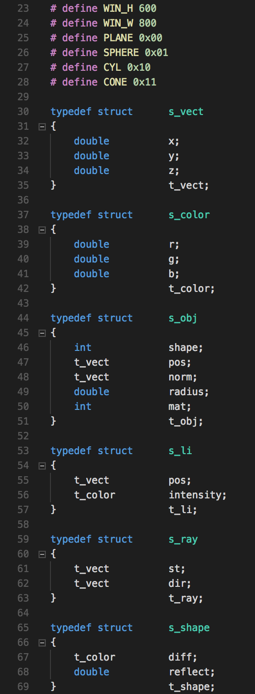
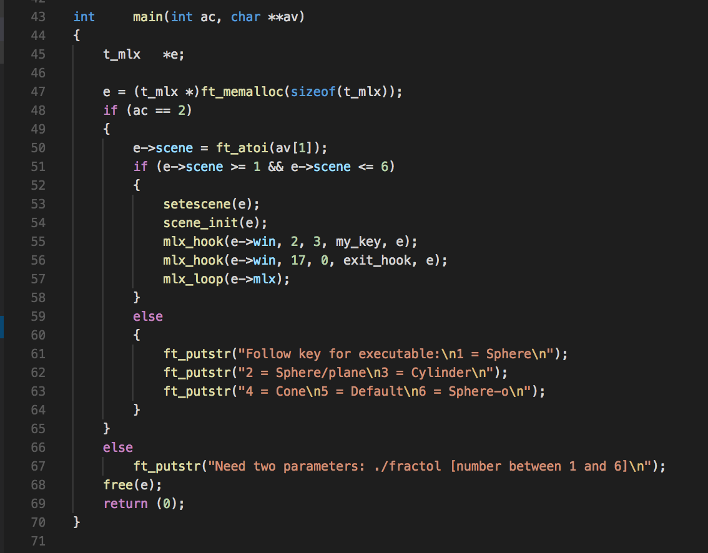
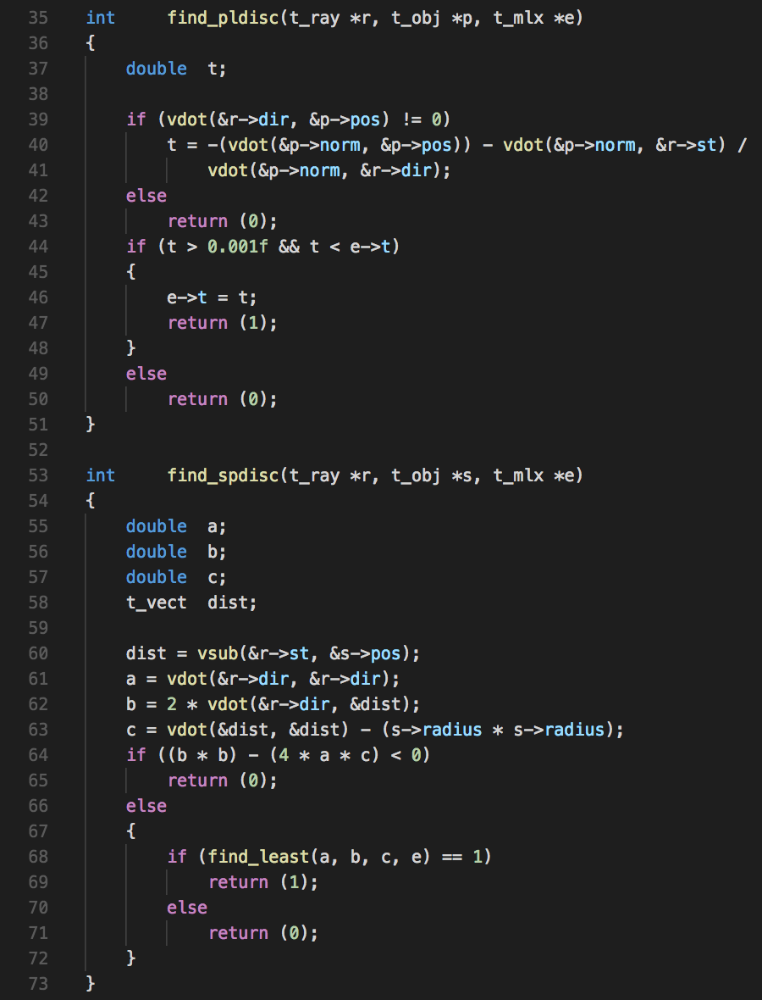
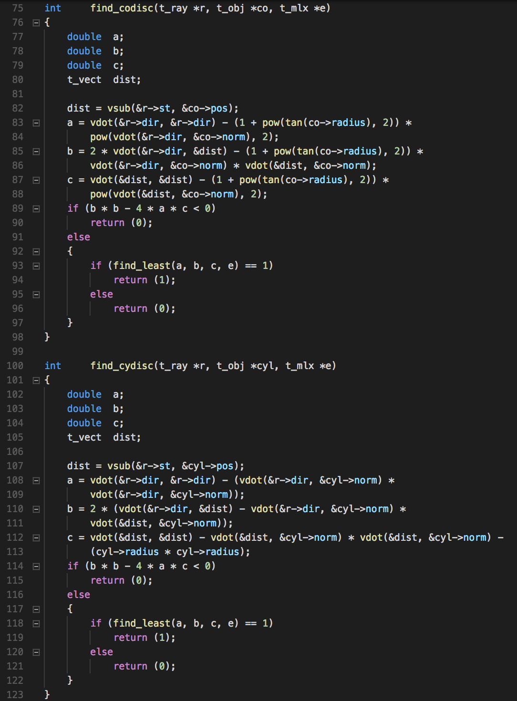
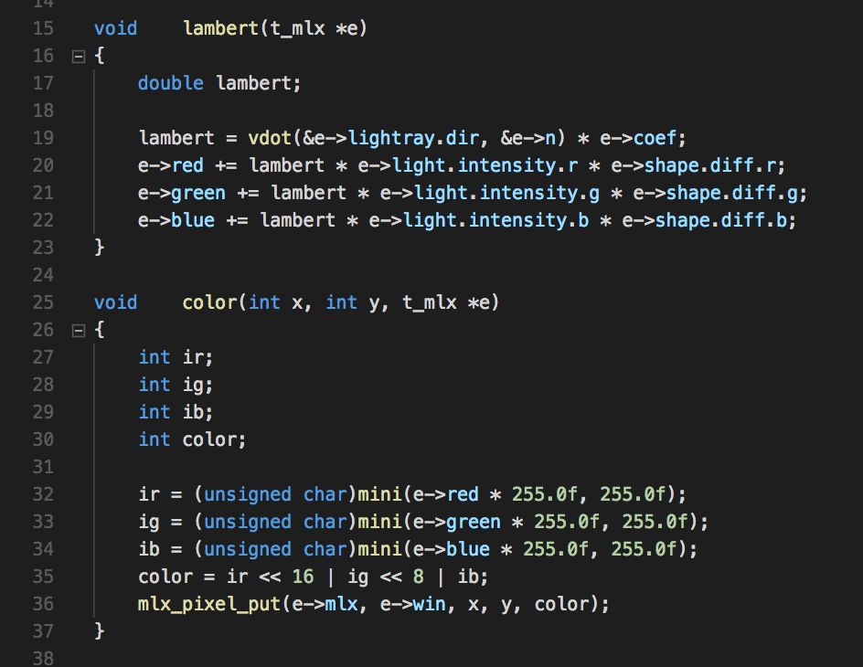
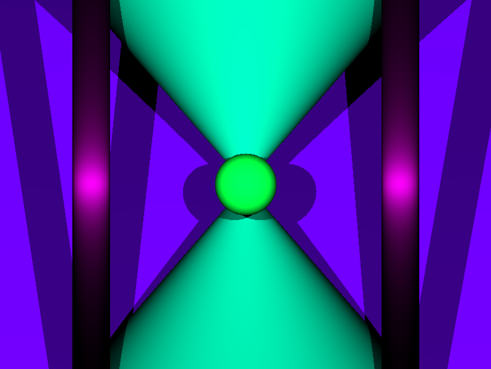

# RTV1

This project focuses on the effects of light on different trigonometric shapes in three dimensional space. In some of the scenes there are multiple lights and shapes to show shadow and light dispersion.

# Implementation
After making the Makefile which incorporates making executables for a library provided called MLX which prints specific colors to pixels on the screen and a short list of key_hooks depending on which scene is being run, an executable is made that incorporates 6 different scenes. Understanding the vector math and how these structs work together is vital.



The way this is run after the Makefile is initiated for first time with make in the command line, is ./rtv1 then 1-6 for the different scenes. These scenes are statically allocated depending on the scene that is desired. However the structs that hold their information largely differ on what the current object is in focus.



The way raytracing works and how my code figures out how to deal with the scene has to do with a couple key features. 3D position, the color of the object in question and how far away the light source is. Through these couple different forms of information we can understand the program.

Essentially the process is started by projecting vectors from each pixel of the screen starting at (0, 0, 0) in terms of the window. From here, if the vector hits an object, first we have to identify it by finding what object it is. This happens by identifying where exactly the object is and the norm or vector the shape plain is on.




From here, we figure out if/when the light hits that point. So using the light position, we find the vector that connects that light ray with that specific point in terms of the camera (AKA screen). Based off of this, we find how that light ray reacts to the object and if there is another object behind it that will be in that objects shadow. Lambert diffusion is used to determine how much the light vs. the color is represented on the affected objects.



For scenes that incorporate rotation, the hook moves the object in a circular orbit around the center of the screen. This is a little tricky because (0, 0, 0) is technically the screen itself so the illusion makes use of fracction rotations of Pi to apply this.


Lastly, the last scene shows orbiting of two objects and how they react to two different lights. For more of the math involved, I included the general idea from one of my main resources from this project. [Raytracing Math](https://www.purplealienplanet.com/node/20).

# Running the Project
Included are three different libraries that I use off and on. MLX is for printing pixels to the screen, libft are most all of the basic C library I had to reproduce at 42 and rt.h has all the information about the different structs used to organize all the different data points needed for this project.

To run it, you can copy and paste this.
```
git clone https://github.com/gsailboat/RTV1.git
cd rtv1
make
```
From there all files are compiled. There happens to be alot of files so it does take a bit of time. Once it is done, you are able to run and interact with the project by using the executable which is ./rtv1. To look at the different maps use numbers 1-6 as the second argument like below.
```
./rtv1 4
```
From there you can exit that screen or rotate the objects depending on what map you are using with the exit key (or exiting the program with the red x) or rotate the objects with the spacebar. 

# Thank You
Thanks to 42 and Ms. Danner from Woodstock Union High School for helping me comprehend the different pieces involved.


